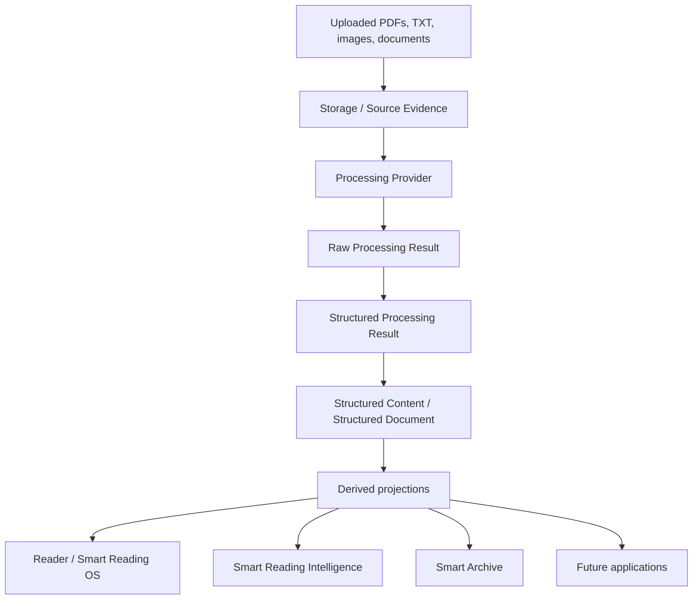
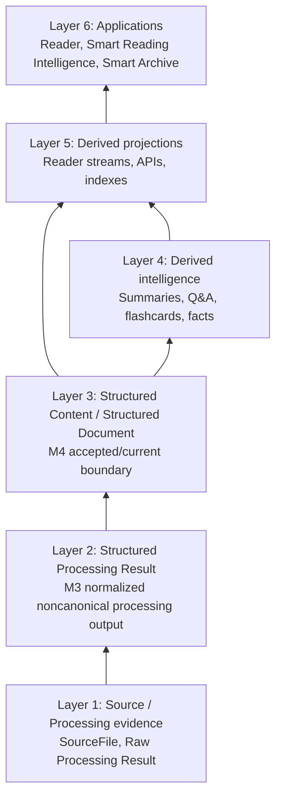

# Document Intelligence Platform Architecture Proposal

| Field | Value |
|---|---|
| Document Type | Target Architecture |
| Approval Status | Proposed |
| Authority Domain | Target Atlas document-intelligence platform architecture |
| Implementation Status | Proposed target only; not a claim that all capabilities are implemented or committed for delivery |

## Status and intent

This document is a proposed target architecture for extending the current PDF OCR and reading systems into a shared Document Intelligence Platform. It is not a claim that all capabilities described here are implemented today.

Current implementation state:

- `pdf-ocr-service` still uses the transitional local PDF path for current uploads.
- `paddle-vl-api` is the target M2 OCR/layout compute boundary, not the active in-process upload pipeline.
- `pdf-ocr-service` is the intended durable owner for documents, source files, processing history, canonical content, assets, evidence, and future document-processing orchestration.
- `speed-reading-trainer` provides existing user-facing speed-reading functionality.

Target state:

- Smart Reading OS and Smart Archive remain long-term product/application concepts over one durable Document Core.
- Roadmap v3 decomposes that vision: M4 provides Structured Content / Structured Document foundations; M5 Reader MVP covers general reading, basic Speed Reading, navigation, Recovery Presentation, lexical search, and optional Notes/highlights; M6 Smart Reading Intelligence covers selected evidence-backed capabilities such as summaries, citation-backed Q&A, Flashcards, Mind Map, AI Tutor/RAG, and semantic search; M7 Smart Archive is a peer application.
- Not every possible Smart Reading feature is required in M6, and Flashcards, Mind Map, AI Tutor/RAG, and semantic search are not M5 requirements.
- Compute services remain replaceable and durable-business-stateless.
- Large binaries live in object storage; PostgreSQL stores metadata and may store approved content, evidence, generated intelligence, indexes, and application records only when later milestones authorize exact designs.

## 1. Purpose and product scope

The platform supports two accepted peer applications over the same document foundation.

| Application | User-facing purpose | Shared document capabilities used |
| --- | --- | --- |
| Smart Reading OS | Speed Reading, full-page reading, focus mode, sessions, comprehension checks, notes, flashcards, mind maps, and reading progress. | Source files, page images, canonical nodes, node regions, generated questions, evidence links, and structured content. |
| Smart Archive | Private or organizational document archive, classification, search, evidence-backed question answering, structured fact extraction, and queries such as “How much did I spend on medical expenses this year, and where are the receipts?” | Immutable originals, page records, OCR observations, canonical revisions, extracted facts, entities, evidence, provenance, and indexes. |

The platform should not maintain separate document systems for Smart Reading OS, Smart Archive, or future applications. Instead, all applications depend on one shared Document Core that owns source identity, page identity, canonical structure, revisions, evidence, and provenance.



## 2. Service boundaries

| Service | Responsibilities | Explicit non-responsibilities |
| --- | --- | --- |
| `paddle-vl-api` | OCR computation; PaddleOCR-VL execution; asynchronous job lifecycle; temporary job status; temporary artifacts; page-level structured OCR observations. | No long-term document ownership; no durable Book, Note, Fact, Course, or user business state; no canonical document revision ownership. It is durable-business-stateless rather than literally stateless because it may hold transient job state and temporary artifacts. |
| `pdf-ocr-service` | Durable system of record; document and source-file ownership; page records; processing orchestration; OCR ingestion; canonical document revisions; assets and evidence; classification and fact extraction; learning-content generation orchestration. | It should not become tightly coupled to one OCR model or one UI. It should call compute providers through explicit processing contracts. |
| `speed-reading-trainer` | User-facing speed-reading application; reading sessions; full-page and focus modes; comprehension tests; reading-progress UI. | It should not own canonical document content, source files, durable OCR observations, facts, or learning-source provenance. It uses APIs and canonical content owned by `pdf-ocr-service`. |

Boundary principle: compute services produce provider-native results; normalization produces noncanonical SPR; M4 decides the Structured Content / Structured Document lifecycle; applications consume projections rather than provider JSON or SPR as canonical truth.

## 3. Data layers



### Layer 1: Source / Archive

Object storage contains large binary objects:

- Original uploaded PDFs, TXT files, images, and other documents.
- Page-rendered images.
- Cropped figures, tables, formulas, and other assets.

PostgreSQL contains structured metadata and references:

- Document metadata.
- Source-file metadata.
- Document versions.
- One record per PDF page.
- TXT line projections where useful.
- Object keys and hashes, not large binary data.

Clarifications:

- Each PDF page is a first-class record.
- Page images support full-page reading.
- Page regions support focus mode and evidence highlighting.
- The original uploaded PDF is retained as the immutable archive original even when page images are stored separately.

### Layer 2: Raw Processing Result and SPR

The processing layer retains provider-specific Raw Processing Results and normalizes them into provider-independent Structured Processing Results before any M4 content decision:

- Raw Processing Results.
- Structured Processing Results.
- Processing runs as conceptual lifecycle identities where approved.
- OCR pages/blocks and diagnostics as processing evidence.
- Model versions, parameters, provenance, confidence, and source evidence references.

Raw Processing Results and SPR are noncanonical. Applications should not use provider payloads as product truth, and Reader should not consume SPR as canonical truth.

TXT analysis should use whole-document planning, chunk processing with overlapping context, and global consistency validation. It should not be modeled as independent one-line-at-a-time classification, because headings, lists, sections, tables of contents, and references often require wider context.

### Layer 3: Structured Content / Structured Document

M4 provides the Structured Content / Structured Document foundation. The exact accepted/current lifecycle remains an M4 decision; this proposal must not select SCV, accepted snapshots, selected candidates, or another lifecycle model. The content boundary may include:

- `Document`.
- Optional `BookProfile`.
- `DocumentRevision`.
- Canonical `Node`.
- Node regions.
- Node relations.
- Provenance and evidence.

Structured Content / Structured Document provides the application-independent accepted/current content boundary for reading sessions, generated learning content, facts, citations, and projections after M4 approves the lifecycle model.

### Layer 4: Generated intelligence, facts, and indexes

Generated intelligence, facts, semantic search, and retrieval indexes are derived from accepted/current content and evidence. They belong to M6 or downstream application milestones unless separately approved, and they remain rebuildable or derived rather than canonical document content:

- Concepts.
- Definitions.
- Claims.
- Relations.
- Entities.
- Metadata candidates.
- Financial transactions.
- Other structured facts.
- Evidence references.

Retrieval indexes remain derived/rebuildable. Generated summaries, citation-backed Q&A, Flashcards, Mind Map, AI Tutor/RAG outputs, and similar intelligence must never silently replace original/accepted document content. Archive metadata remains M7 application metadata and does not own canonical document content.

### Layer 5: Applications

Application records should reference shared durable document entities rather than copying source data:

- Smart Reading OS.
- Smart Archive.
- Future applications.

## 4. Original document and page model

Both immutable originals and page-oriented derivatives are retained because they serve different needs.

| Object | Purpose |
| --- | --- |
| Original file | Immutable archive object. Preserves signatures, forms, bookmarks, annotations, embedded text, metadata, original byte stream, and evidentiary value. |
| Page records/images | Application-oriented derivatives for reading, OCR, region selection, evidence highlighting, and page-level processing. |
| Cropped assets | Focus-mode regions, figures, tables, formulas, and other reusable evidence/display assets. |

Page images support full-page reading. Cropped assets support focus mode. Retaining page images must not imply discarding the original upload.

A possible object-storage layout is:

```text
documents/{document_id}/sources/{version}/original.pdf
documents/{document_id}/pages/000001.webp
documents/{document_id}/assets/{asset_id}.png
documents/{document_id}/artifacts/{artifact_id}.json.gz
```

The exact key scheme remains implementation-defined, but object keys should be durable references stored in PostgreSQL alongside hashes and metadata.

## 5. General Document model

`Book` is not the universal top-level object. The universal entity should be `Document`, with an optional `BookProfile` for book-specific metadata such as author, ISBN, publisher, edition, chapter conventions, and reading-oriented presentation preferences.

Proposed document types include:

- `book`
- `article`
- `receipt`
- `invoice`
- `medical_document`
- `bank_statement`
- `tax_document`
- `contract`
- `letter`
- `manual`
- `identity_document`
- `image`
- `other`

This allows archive and learning workflows to share the same document foundation without forcing every object into a book model.

## 6. Canonical Node model

Proposed `document_nodes` fields:

| Field | Purpose |
| --- | --- |
| `id` | Stable node identifier within the revision. |
| `document_id` | Owning document. |
| `revision_id` | Owning canonical revision. |
| `type` | Limited canonical type, such as `chapter`, `paragraph`, or `figure`. |
| `subtype` | Optional more specific classification. |
| `parent_id` | Parent node for tree structure. |
| `sibling_order` | Ordering among siblings. |
| `text` | Node text as represented in the canonical revision. |
| `normalized_text` | Search/comparison-friendly text where useful. |
| `location` / `regions` | Page and region references, including multi-page locations. |
| `confidence` | Confidence in node extraction or classification. |
| `provenance` | Links to OCR blocks, text observations, processing runs, and source files. |
| `metadata` | Type-specific structured metadata. |
| `timestamps` | Creation and update metadata. |

Important decisions:

- Store `parent_id` plus `sibling_order` as the database truth.
- Do not also persist `children` arrays as a second source of truth.
- Build `children` arrays only in API responses.
- Support multiple page regions for cross-page nodes.
- Include page dimensions or normalized coordinates so regions are portable across image sizes.
- Preserve provenance to OCR blocks and processing runs.

Initial node types should be intentionally limited and extensible.

Structural examples:

- `front_matter`
- `body`
- `back_matter`
- `part`
- `chapter`
- `section`
- `subsection`
- `appendix`
- `bibliography`
- `toc`

Content examples:

- `heading`
- `paragraph`
- `list`
- `list_item`
- `quote`
- `code_block`
- `figure`
- `caption`
- `table`
- `formula`
- `footnote`
- `endnote`

Sentence should normally be a derived layer, not a default canonical node. Page break generally belongs in location data unless the page break has semantic meaning in the source document.

## 7. Node relations

The document is not purely a tree. A tree captures containment and reading order, but documents also contain cross-references, captions, continuations, notes, and derivations.

Proposed relation types include:

| Relation | Example use |
| --- | --- |
| `caption_of` | Caption node describes a figure, table, or formula. |
| `references` | A paragraph or note references another node or external entity. |
| `footnote_of` | Footnote is attached to a source text span or node. |
| `toc_target` | Table-of-contents entry points to a section or chapter. |
| `continued_from` | Table, list, or paragraph continues from a previous node. |
| `continued_to` | Table, list, or paragraph continues to a later node. |
| `derived_from` | Generated or normalized node derives from another source node. |

Relations should include source and target identifiers, relation type, optional metadata, confidence, and provenance.

## 8. Raw artifact retention

Retention policy:

- Compact normalized observations are durable.
- Full raw model artifacts have a TTL by default.
- A user may explicitly retain raw artifacts.
- Problematic or low-confidence samples may be retained automatically for debugging, quality review, or model improvement.
- Retained artifacts should be copied into storage owned by `pdf-ocr-service`.
- The system must not depend on temporary `paddle-vl-api` artifacts after ingestion.

`paddle-vl-api` artifacts are temporary delivery outputs. After ingestion, durable references must point to `pdf-ocr-service` owned records or storage objects.

## 9. Private archive fact model

Canonical nodes alone are insufficient for questions such as:

> “How much did I spend on medical expenses this year?”

Answering this requires normalized, queryable facts: dates, vendors, amounts, categories, document classes, and evidence references. The platform should therefore include structured archive-intelligence tables such as:

- `extracted_facts`
- `financial_transactions`
- `entities`
- `dates`
- Evidence links

Every extracted fact should support:

- Source document.
- Page.
- Canonical node or OCR block.
- Bounding box or region.
- Confidence.
- Extraction run.
- User verification state.

Aggregation should be performed using structured queries over normalized facts and transactions. LLMs can explain the results, resolve ambiguity, and cite evidence, but they should not be the sole calculator for financial totals.

## 10. Smart Reading OS learning model

Learning-oriented Smart Reading OS data should reference canonical source revisions and evidence.

Proposed model areas:

- Courses.
- Learning units.
- Notes.
- Summaries.
- Concepts.
- Flashcards.
- Questions.
- Mind maps.
- Study sessions.
- Mastery records.

Notes:

- Anchored page, node, and text-region notes.
- Standalone notes.
- AI-generated notes clearly distinguished from user notes.

Summary types:

- `brief`
- `summary`
- `detailed_summary`
- `key_points`
- `executive_summary`
- `study_guide`

Generated content must retain:

- Source revision.
- Source node IDs.
- Model.
- Prompt version.
- Generation run.
- Status.
- Content hash.
- Evidence.

## 11. Flashcards and Anki

The platform should define an internal `Flashcard` model independent of Anki.

Card types:

- `basic`
- `basic_reversed`
- `cloze`
- `definition`
- `question_answer`
- `image_occlusion`

Anki should be integrated through an Anki Adapter rather than used as the core data model. Recommended workflow:

```text
Generate candidate cards
→ User review/edit
→ Approve
→ Sync/export to Anki
```

Flashcards should include deduplication keys, source evidence, content hashes, review status, and synchronization metadata such as external deck ID, external note ID, external card ID, last synced timestamp, sync status, and sync errors.

## 12. Mind maps

Mind maps should be stored as editable graph data, not only as rendered images.

Proposed mind-map data:

- Nodes.
- Edges.
- Labels.
- Relation types.
- Source evidence.

Rendered images may be cached as presentation artifacts, but the durable representation should preserve the editable graph, layout metadata, source links, and provenance.

## 13. Reading comprehension and quizzes

Question types:

- `multiple_choice`
- `true_false`
- `short_answer`
- `fill_blank`
- `matching`
- `ordering`
- `summary_selection`
- `evidence_location`

Learning objectives:

- `recall`
- `understanding`
- `application`
- `analysis`
- `synthesis`
- `evaluation`

For speed-reading sessions, generated comprehension checks should emphasize:

- Main idea.
- Document structure.
- Key facts.
- Author position.
- Cause and effect.
- Basic inference.
- Figures and tables.

Every generated question should include:

- Correct answer.
- Explanation.
- Evidence.
- Source range.
- Difficulty.
- Learning objective.
- Generation run.
- Review status.

A generator/verifier pipeline is recommended: one step generates candidate questions and another verifies answerability, evidence support, difficulty, and ambiguity before questions are published or shown by default.

## 14. Speed-reading metrics

Speed-reading records should include:

- Reading session.
- Covered pages and nodes.
- Reading time.
- WPM.
- Comprehension score.
- Answer response time.
- Delayed retention where supported.

WPM alone is not sufficient because fast reading without comprehension is not successful reading. The conceptual metric is:

```text
effective reading rate = reading speed × comprehension
```

This formula does not need to become a stored field immediately. The system can store the underlying measures and compute derived metrics in analytics or API responses.

## 15. Versioning and human review

Versioning model:

- Immutable source versions.
- Processing runs.
- Canonical document revisions.
- Generated-content versions.
- User edits.
- Published, draft, and stale status.
- Automatic content must not overwrite user-edited content.

Suggested statuses:

- `generated`
- `reviewed`
- `user_edited`
- `approved`
- `published`
- `stale`
- `archived`

If a source file or canonical revision changes, generated content derived from older revisions should become stale rather than silently mutating in place. User-edited content should be preserved and may require explicit rebase, regeneration, or review.

## 16. Temporary MinerU-Popo storage

MinerU-Popo direct output may use temporary SQLite or compressed JSON/JSONL during a single job. This temporary storage must not become the long-term system of record and must not become a shared production database.

Flow:

```text
MinerU-Popo output
→ temporary SQLite/JSON artifact
→ M4 content/projection builder
→ PostgreSQL transaction when approved
→ optional retained debug artifact
```

A future M4 content/projection builder would be responsible for transforming temporary job output into approved `pdf-ocr-service` owned records; this proposal does not authorize that schema or implementation.

## 17. Initial logical data model

This is a non-binding first-pass target inventory, not a requirement to implement all tables immediately.

| Concern | Candidate tables |
| --- | --- |
| Core | `documents`, `source_files`, `document_versions`, `document_pages`, `document_assets`, `source_text_lines` |
| Processing | `processing_runs`, `ocr_runs`, `ocr_pages`, `ocr_blocks`, `text_analysis_runs`, `text_line_observations`, `artifacts` |
| Canonical | `document_revisions`, `document_nodes`, `node_regions`, `node_relations` |
| Archive intelligence | `document_classifications`, `metadata_candidates`, `extracted_facts`, `financial_transactions`, `entities` |
| Smart Reading OS learning features | `learning_courses`, `learning_units`, `notes`, `summaries`, `concepts`, `concept_mentions`, `concept_relations`, `flashcards`, `mindmaps`, `question_items`, `question_attempts`, `study_sessions`, `mastery_records` |

Implementation should deliver these incrementally and only when required by a testable capability.

## 18. Incremental delivery strategy

Principle:

```text
One independently testable capability per PR.
```

High-level sequence aligned to Atlas Roadmap v2:

1. M1 Foundation.
2. M2 Document Processing Foundation.
3. M3 provider-independent Structured Processing Result, followed by M4 Structured Content / Structured Document foundation.
4. M4 Smart Reading OS.
5. M5 Smart Archive.

M4 and M5 may evolve partly in parallel after M3 contracts are sufficiently
stable.

Each PR should introduce a narrow capability with migrations, APIs, tests, and documentation appropriate to that capability. Cross-cutting refactors should be split from feature delivery where possible.

## 19. Architecture decisions and open questions

### Confirmed decisions

- `pdf-ocr-service` owns durable data.
- `paddle-vl-api` owns no durable business state.
- S3/R2-compatible object storage stores large binary objects.
- PostgreSQL stores metadata and structured data.
- Original source files are retained.
- PDF pages are first-class entities.
- Raw OCR artifacts are not retained permanently by default.
- Generated content must preserve evidence and provenance.
- The three product areas share one Document Core.

### Open questions

- Exact object storage provider.
- Exact deployment environment for `pdf-ocr-service`.
- Authentication and tenant model.
- Whether page images are eagerly or lazily rendered.
- MinerU-Popo integration contract.
- Vector search implementation.
- Anki integration method.
- Mind-map frontend library.
- Revision publication workflow.
- Data retention and privacy policies.

## 20. Non-goals

This document does not finalize:

- Exact SQL schema.
- Exact API endpoints.
- UI design.
- LLM provider.
- Vector database.
- MinerU-Popo implementation details.
- Anki connector implementation.
- Complete Phase 4 backlog.

## 21. Accepted Atlas philosophy baseline

Atlas is a Document Intelligence Platform. Its mission is to transform real-world information into structured, verifiable, reusable knowledge.

The durable business aggregate root is `Document`. `Document` does not mean PDF; it represents a real-world information object such as a book, receipt, invoice, contract, medical record, research paper, note, picture, audio, video, email, web page, or future document type.

`Document` replaces `Bookshelf` as the long-term business object. Current Reader compatibility may continue exposing Bookshelf-shaped API responses during transition, but internally the durable business object is `Document`.

`SourceFile` represents immutable evidence. A `Document` may have one or many source files, including PDFs, text files, Markdown, images, office documents, EPUBs, audio, video, HTML, email, ZIP archives, and future formats.

`Document` stores business identity, type, status, metadata, ownership, and lifecycle. It must not become a container for OCR results. AI processing belongs in separate processing and observation concepts.

## 22. Conceptual processing pipeline

The current Roadmap v3-facing architectural direction is:

```text
Source Evidence / SourceFile
  ↓
Storage
  ↓
Processing Provider
  ↓
Raw Processing Result
  ↓
Structured Processing Result
  ↓
Structured Content / Structured Document
  ↓
derived projections
  ↓
Reader / Smart Reading Intelligence / Smart Archive
```

Earlier conceptual wording in this proposal used `ProcessingRun`, `Observation`, and Canonical Knowledge to describe a broad long-term relationship. Those terms remain conceptual and do not approve database tables, API resources, durable ProcessingRun persistence, durable Observation rows, or a new knowledge ontology. In Roadmap v3 terms, ProcessingRun may connect source evidence, Raw Processing Result, SPR, diagnostics, retry/rebuild, and status; Observation may map to raw evidence, SPR diagnostics/evidence, or later evidence structures depending on approved design.

Applications such as Reader, Smart Reading Intelligence, Archive, Search, and Analytics should consume Structured Content / Structured Document through derived projections rather than raw OCR output, provider JSON, or SPR as canonical truth. Generated M6 intelligence remains derived and must not silently replace accepted/current document content.

## 23. Metadata model distinctions

Atlas uses separate metadata concepts for separate questions:

| Concept | Question answered | Examples |
|---|---|---|
| Document Type | What is it? | `book`, `receipt`, `invoice`, `contract`, `note`, `picture`, `audio`, `video`, `email`, `webpage`, `other` |
| Category | What is it about? | Medical, Finance, History, Education, Family |
| Collection | How does the user organize it? | Spanish Learning, 2026 Taxes, Research |
| Domain | How should AI understand it? | Medical, Finance, Education, Legal |

These concepts must not be collapsed into one field. Document Type identifies the real-world object. Category describes topic. Collection is user organization. Domain guides AI interpretation.

## 24. Schema and implementation principles

Use this accepted wording when reviewing future implementation scope:

```text
Architecture guides the schema.
Current requirements justify the schema.
Compatibility governs schema evolution.
```

The current temporary schema is not a long-term contract. Reader API compatibility is a long-term contract until deliberately versioned.

Future implementation should evolve incrementally. Atlas must not implement the entire future platform at once; small validated iterations remain the project strategy.
