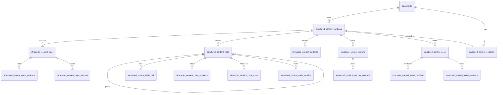
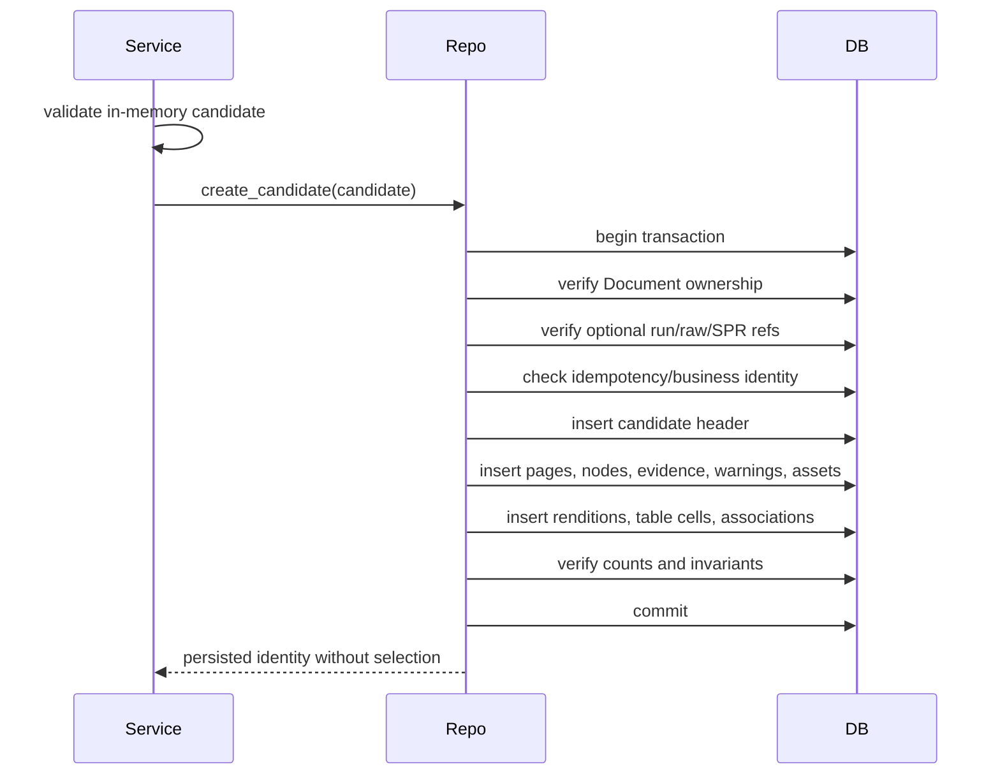
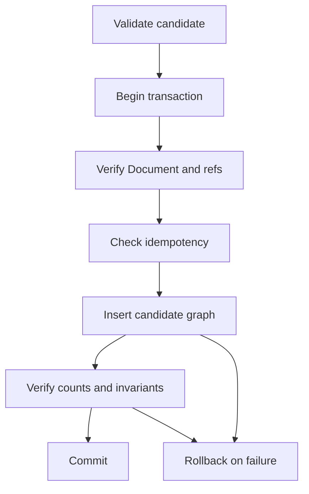
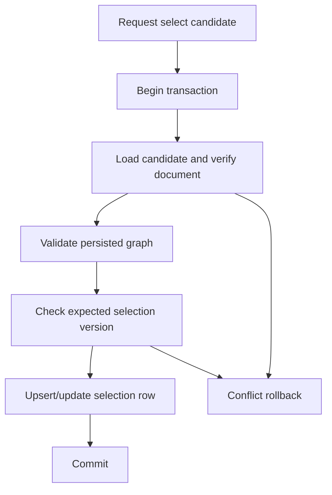

# M4 Slice 2 Structured Content Persistence Plan

| Field | Value |
|---|---|
| Title | M4 Slice 2 Structured Content Persistence Plan |
| Document Type | Implementation Plan |
| Status | Proposed |
| Activity | Active |
| Milestone | M4 |
| Scope | Slice 2 persistence planning |
| Effective Date | 2026-07-22 |
| Implementation Authorization | Not granted by this document |
| Supersedes | None |
| Related ADRs | [ADR-002](../architecture/adr/ADR-002-structured-content-lifecycle-and-selection.md), [ADR-003](../architecture/adr/ADR-003-structured-content-shape-and-transformation.md), [ADR-004](../architecture/adr/ADR-004-provenance-evidence-assets-and-processing-runs.md), [ADR-005](../architecture/adr/ADR-005-projection-compatibility-migration-and-retention.md) |
| Baseline | PR #126 merge commit `ba35148dcf781d0ab1d42deaad185cbb689045ee` |

This plan is non-normative where it summarizes accepted ADRs. The accepted ADRs remain authoritative. This document does not implement or authorize schema changes, ORM models, migrations, repositories, services, APIs, projection, Reader behavior, backfill, retention, deletion, or production release. Merge status for this plan does not imply implementation authorization. M4 remains In Progress.

## 1. Executive Summary

Slice 2 should persist immutable `StructuredContentCandidate` graphs as normalized relational state keyed to the existing `documents` aggregate. Candidate creation is an insert-only transaction that validates the in-memory candidate, inserts the candidate graph, verifies reconstruction invariants, and commits without selecting the candidate. Selection is a separate explicit transaction using a one-row-per-document `structured_content_selection` table that points at a persisted candidate and can atomically replace that pointer for rollback or promotion.

Recommended bounded sequence: Slice 2A ORM schema and migrations; Slice 2B repository write/read round-trip; Slice 2C explicit selection repository/service; Slice 2D minimal ProcessingRun/provenance integration; Slice 2E regression, concurrency, and scale verification. These slices are proposals only and are not authorized by this document.

## 2. Current Repository Database Architecture

Verified facts:

- Engine configuration is SQLAlchemy with a default SQLite URL `sqlite:///./ocr_tasks.db`; non-SQLite deployments may use any SQLAlchemy `DATABASE_URL`.
- SQLite is configured with `check_same_thread=False` for request/background usage.
- SQLAlchemy style is classic declarative mapping via `declarative_base()` and `Column`, not SQLAlchemy 2.0 typed `Mapped` style.
- Request sessions are produced by `SessionLocal = sessionmaker(autocommit=False, autoflush=False, bind=engine)` and closed by a FastAPI dependency.
- Production startup applies Alembic migrations through `init_db()`; `create_all()` remains only in an isolated in-memory `DatabaseService` test path.
- Alembic is the migration framework. `alembic/env.py` uses `Base.metadata`, `compare_type=True`, and a single migration revision currently exists: `0001_foundation_schema`.
- Existing primary keys are string UUIDs generated in Python by `str(uuid.uuid4())`.
- Existing foreign keys cascade from `documents.id` to child tables with `ondelete="CASCADE"` and ORM relationships often use `cascade="all, delete-orphan"`.
- Timestamps are naive `DateTime` values populated with `datetime.utcnow` and `onupdate=datetime.utcnow`.
- Enum persistence is mixed: `OCRTask.status` uses SQLAlchemy `Enum(TaskStatus)` while `Document.document_type` is stored as a validated lowercase `String(50)`.
- JSON payloads are currently stored as `Text` strings in `PdfPage.ocr_raw_json` and `MineruResult.result_json`; there is no existing mapped SQLAlchemy JSON/JSONB column.
- Soft-delete/retention is not a general model convention. `SourceFile.retained` is an integer retention flag; destructive document cascade behavior exists for legacy child rows.
- Tests create in-memory SQLite engines or temporary SQLite files; migration tests use Alembic upgrade/downgrade against SQLite.

Inferences:

- Production database compatibility is intended through SQLAlchemy URLs, but the repository evidence only proves SQLite behavior in tests. PostgreSQL-specific JSONB, partial indexes, row locks, and enum DDL should not be assumed without explicit implementation tests.
- New Slice 2 schema should remain additive and portable, using `Text` for deterministic JSON where portability is more important than database-native JSON operations.

## 3. Existing Relevant Data Model

Inventory:

| Model or artifact | Table or shape | Path | Relevant ownership |
|---|---|---|---|
| `Document` | `documents` | `app/models.py` | Aggregate root for uploaded documents. |
| `SourceFile` | `source_files` | `app/models.py` | Child of `documents` via `document_id`; source evidence metadata. |
| `OCRTask` | `ocr_tasks` | `app/models.py` | Standalone task table; not document content truth. |
| `ContentBlock` | `content_blocks` | `app/models.py` | Legacy content rows owned by `documents` through `book_id`. |
| `BookImage` | `book_images` | `app/models.py` | Legacy binary image rows owned by `documents` through `book_id`; globally unique `image_id`. |
| `PdfPage` | `pdf_pages` | `app/models.py` | Legacy page raster/OCR rows owned by `documents` through `book_id`; contains provider raw JSON text. |
| `MineruResult` | `mineru_results` | `app/models.py` | One legacy structured result per document through unique `book_id`; contains result JSON text. |
| Raw Processing Result | dataclass envelope | `app/processing/raw_result.py` | Noncanonical retained processing artifact identity; no ORM table found. |
| Structured Processing Result | dataclass model | `app/processing/structured_result/models.py` | Noncanonical normalized processing artifact; no ORM table found. |
| ProcessingRun | conceptual only | ADR-004 and processing modules | No durable ORM model found at baseline. |
| Structured Content | frozen dataclasses | `app/structured_content/model.py` | In-memory candidate graph only; no ORM model found. |

Existing foreign keys are simple document-child relationships from `book_id` or `document_id` to `documents.id`; child deletion is cascade-based. Reader-related routes currently depend on legacy `MineruResult`, `ContentBlock`, `PdfPage`, and `BookImage` behavior. No current table records selected/current Structured Content.

## 4. Proposed Persistence Boundary

Slice 2 durable state should include enough normalized relational rows to reconstruct a complete `StructuredContentCandidate` without provider access:

- candidate identity, document binding, lineage, transformer/policy refs, optional processing/raw/SPR refs, recovery summary, and extensions;
- pages with semantic order, source page index, dimensions, coordinate frames, warnings, evidence, root ordering;
- nodes with bounded node vocabulary, hierarchy, sibling order, source locations, typed attributes, evidence, assets, warnings, and extensions;
- evidence anchors as locators, not copied provider payloads;
- warnings as content warnings, not validation issue logs;
- logical assets and renditions as metadata/storage references, not embedded bytes;
- table row/cell semantics sufficient for deterministic reconstruction.

Slice 2 should not persist canonical serializer bytes as a second canonical store. The canonical durable state should be normalized relational content. An optional `canonical_sha256` on `structured_content_candidate` may be stored only as an integrity checksum computed from deterministic serialization after graph validation; it must not become an independent source of truth. Provider payload copying is excluded. This matches ADR-003's provider-independent content shape and avoids dual canonical stores.

## 5. Proposed Relational Model

### 5.1 Logical diagram

### 5.2 Table proposals

`structured_content_candidate`:
- Purpose: immutable candidate version header and reconstruction root.
- PK: `id` string UUID.
- Business identity: `candidate_id` string from `ContentCandidateId`.
- Candidate/version FK: self-root; `document_id` FK to `documents.id` with `RESTRICT` preferred initially or `CASCADE` only if project confirms document deletion should delete immutable candidates.
- Columns: `document_id` not null, `candidate_id` not null, `lineage_key` not null, `schema_id`, `schema_version`, `transformer_ref`, `transformation_policy_ref`, `processing_run_ref`, `raw_result_ref`, `structured_processing_result_ref`, recovery summary fields, `extensions_json`, optional `canonical_sha256`, `created_at`.
- Nullability: refs nullable except `document_id`, `candidate_id`, `lineage_key`, schema/recovery/count/timestamp.
- Uniqueness: unique `candidate_id`; unique `(document_id, candidate_id)`; unique idempotency key described in Section 6.
- Indexes: by `document_id, created_at`; by `lineage_key`; by `processing_run_ref`; by raw/SPR refs where populated.
- Immutable fields: all fields after insert.
- JSON: deterministic `Text` for extensions.

`structured_content_page`:
- Purpose: candidate pages and page-root order carrier.
- PK: string UUID.
- Business identity: `page_id` scoped to candidate.
- FK: `candidate_id_fk` to candidate `id` with cascade within failed transaction; document derived through candidate.
- Columns: `page_id`, `source_page_index`, `page_order`, `page_label`, dimensions, coordinate frame fields, `rotation_degrees`, `recovery_state`, `root_node_ids_json` optional only if root order is not normalized, `extensions_json`.
- Uniqueness: `(candidate_id_fk, page_id)`, `(candidate_id_fk, page_order)`, `(candidate_id_fk, source_page_index)` only if validator requires one content page per source page.
- Indexes: `(candidate_id_fk, page_order)`.
- Immutable fields: all after insert.

`structured_content_node`:
- Purpose: candidate nodes, hierarchy, ordering, core text, and common typed metadata.
- PK: string UUID.
- Business identity: `node_id` scoped to candidate.
- FKs: candidate, page, nullable parent node. Composite same-candidate checks require repository validation and, if feasible, composite FKs/unique pairs.
- Columns: `node_id`, `lineage_key`, `node_type`, `page_id_fk`, `parent_node_id_fk`, `sibling_order`, `root_order` nullable for page roots, `text`, `recovery_state`, source location JSON or normalized child table, typed scalar columns for common attributes, `attributes_kind`, `attributes_json`, `extensions_json`.
- Uniqueness: `(candidate_id_fk, node_id)`, `(candidate_id_fk, page_id_fk, parent_node_id_fk, sibling_order)`, `(candidate_id_fk, page_id_fk, root_order)` where root.
- Indexes: by candidate/page/parent/sibling order; by lineage.
- Immutable fields: all after insert.

`structured_content_evidence`:
- Purpose: durable `EvidenceReference` locator registry.
- PK: string UUID.
- Business identity: `evidence_id` scoped to candidate.
- FK: candidate; optional hard FK to `source_files.id` when `source_file_ref` points to an existing `SourceFile`.
- Columns: `evidence_id`, `kind`, `source_file_ref`, `source_page_index`, bounding box/span fields, `raw_result_ref`, `structured_processing_result_ref`, `spr_node_ref`, `spr_observation_ref`, `spr_evidence_ref`, `warning_ref`, `extensions_json`.
- Uniqueness: `(candidate_id_fk, evidence_id)`.
- Indexes: candidate/kind; source file/page; raw/SPR refs.
- JSON: extensions only; no provider payload blob.

`structured_content_warning`:
- Purpose: persisted `ContentWarning` registry.
- PK: string UUID.
- Business identity: `warning_id` scoped to candidate.
- FK: candidate.
- Columns: `warning_id`, `code`, `severity`, `scope_path`, `safe_summary`, `recoverable`, `blocking_hint`, `details_json`, `extensions_json`.
- Uniqueness: `(candidate_id_fk, warning_id)`.
- Indexes: candidate/severity/code.
- Immutable after insert; validation issues are not automatically written here.

`structured_content_asset`:
- Purpose: logical asset identities.
- PK: string UUID.
- Business identity: `asset_id` scoped to candidate.
- FK: candidate.
- Columns: `asset_id`, `role`, `recovery_state`, source location fields, media metadata, checksum, byte size, dimensions, caption, alt text, description, `extensions_json`.
- Uniqueness: `(candidate_id_fk, asset_id)`.
- Indexes: candidate/role/recovery state.
- No bytes; no storage provider requirement.

`structured_content_asset_rendition`:
- Purpose: optional physical or derived rendition references for assets.
- PK: string UUID.
- Business identity: `rendition_id` scoped to candidate or asset.
- FKs: candidate and asset.
- Columns: `rendition_id`, `role`, optional `rendition_order`, media type, checksum, dimensions, `artifact_ref`, `recovery_state`, `rebuildable`, `extensions_json`.
- Uniqueness: `(candidate_id_fk, rendition_id)`, `(asset_id_fk, role, rendition_order)` if ordering is meaningful.
- Indexes: asset/order; candidate/role.

Association tables:
- `structured_content_node_evidence(node_id_fk, evidence_id_fk, evidence_order)`, unique `(node_id_fk, evidence_id_fk)` and `(node_id_fk, evidence_order)`.
- `structured_content_node_asset(node_id_fk, asset_id_fk, asset_order)`, unique `(node_id_fk, asset_id_fk)` and `(node_id_fk, asset_order)`.
- `structured_content_node_warning(node_id_fk, warning_id_fk, warning_order)`, unique `(node_id_fk, warning_id_fk)` and `(node_id_fk, warning_order)`.
- `structured_content_page_evidence(page_id_fk, evidence_id_fk, evidence_order)`.
- `structured_content_page_warning(page_id_fk, warning_id_fk, warning_order)`.
- `structured_content_asset_evidence(asset_id_fk, evidence_id_fk, evidence_order)`.
- `structured_content_warning_evidence(warning_id_fk, evidence_id_fk, evidence_order)`.
- Each association uses candidate-compatible repository checks because ordinary FKs do not guarantee all referenced rows belong to the same candidate unless composite constraints are added.

Root-node order representation:
- Recommended minimum: store root page membership and order directly on `structured_content_node` using nullable `parent_node_id_fk` and non-null `root_order` for roots, with uniqueness `(candidate_id_fk, page_id_fk, root_order)` for root nodes. Avoid duplicating `root_node_ids_json` unless reconstruction performance evidence requires it.

Specialized node attributes:
- Recommended minimum hybrid: typed scalar columns for frequent addressable attributes (`heading_level`, list flags, target IDs, rendered asset IDs, formula notation/role), plus deterministic `attributes_json` for less common fields and namespaced typed extensions. Attribute kind must match `node_type` in validator/repository tests.

Tables:
- Recommended normalized cell table `structured_content_table_cell` with PK UUID, FK to table node, `row_index`, `column_index`, spans, text, `extensions_json`, unique `(node_id_fk, row_index, column_index)`, and index by table node row/column. Table row/column counts may live on the table node typed scalar columns. Separate row table is deferred unless row-level metadata becomes required.

Selection:
- Recommended `structured_content_selection` table described in Section 8.

## 6. Candidate Identity and Versioning

- Database primary key: internal string UUID `structured_content_candidate.id`; never exposed as the content identity contract.
- `ContentCandidateId`: durable business identity from the in-memory candidate; unique globally or at least unique per document. Recommended global uniqueness simplifies opaque lookups.
- `ContentLineageKey`: stable lineage/retry grouping key; not a database primary key. Unique only when paired with deterministic producer inputs if policy requires; multiple versions may share lineage.
- `DocumentRef`: maps to `documents.id`; candidate `document_ref` must equal owning `document_id`.
- `ProcessingRunRef`: opaque at Slice 2A unless a minimal ProcessingRun table is introduced; later can become a hard FK.
- `SPRRef` and `RawResultRef`: opaque artifact/reference strings initially because no ORM tables exist.
- `TransformerRef` and `TransformationPolicyRef`: immutable strings identifying transformer implementation and policy/config.

Idempotency should use a deterministic creation key such as `(document_id, candidate_id)` and optionally `(document_id, lineage_key, transformer_ref, transformation_policy_ref, raw_result_ref, structured_processing_result_ref, canonical_sha256)`. On duplicate insert, repository returns the existing persisted identity if the stored checksum and business fields match; otherwise it raises `StructuredContentCandidateAlreadyExists` or `CandidatePersistenceConflict`.

## 7. Candidate Immutability

Immutability enforcement:
- Application service validates a frozen in-memory `StructuredContentCandidate` before persistence.
- Repository exposes no generic update/delete APIs for candidate graph rows.
- ORM mappings should avoid write-oriented relationship mutation methods beyond construction in the transaction.
- Database constraints enforce required fields, uniqueness, and ownership links; they cannot enforce all semantic immutability.
- Tests should prove no repository update path exists and that selection changes do not mutate candidate rows.

Slice 2 should not implement destructive candidate deletion. Failed transactions roll back before commit. Future retention/deletion requires a separately authorized slice.

## 8. Selection Model

Alternatives:

A. `selected_candidate_id` on `documents`: simple lookup and one row per document, but it modifies the existing aggregate, couples lifecycle to `Document`, complicates audit history, and may require batch operations on SQLite when adding constraints.

B. Separate `structured_content_selection`: one row per document with `document_id`, `selected_candidate_db_id`, version/timestamp/actor/reason fields. It keeps selection mutable but separate from immutable candidates, supports zero-or-one selection, atomic replacement, rollback, future history, and additive migration.

C. `accepted`/`current` flags on candidates: rejected because it mutates candidate rows, risks multiple current flags, and contradicts the in-memory model's reserved extension keys and ADR-002 lifecycle separation.

Recommendation: use `structured_content_selection`. Columns: `document_id` PK/FK, `selected_candidate_id` FK to candidate internal PK, `selection_version` integer not null default 1, `selected_at`, `selected_by`, `reason`, `selection_policy_ref`, `previous_candidate_id` nullable, and optional `extensions_json`. A unique or composite check must ensure selected candidate belongs to the same document; if composite FK portability is awkward, enforce in repository within the same transaction and test it. Zero selection is represented by absence of a row. Clearing selection should be excluded unless explicitly authorized.

## 9. Selection Transaction

Algorithm:

1. Open repository-owned transaction or join caller transaction.
2. Resolve `document_id` and candidate by `ContentCandidateId` or internal ID.
3. Verify candidate exists, belongs to the document, and has a complete persisted graph that passes reconstruction validation.
4. If optimistic request includes expected current candidate/version, compare against `structured_content_selection.selection_version`; mismatch raises `CandidateSelectionConflict`.
5. Lock selection row where supported. For SQLite tests, rely on transaction serialization and unique PK behavior; for production engines, use `SELECT ... FOR UPDATE` or an atomic upsert/update with version predicate.
6. Insert or update the one selection row with the new candidate, timestamp, actor/reason, previous candidate pointer, and incremented version.
7. Commit.
8. Return selected candidate identity and selection version.

Rollback to prior content is the same algorithm selecting an earlier valid candidate. Failure anywhere rolls back the selection row update and never mutates candidate rows.

## 10. Atomic Candidate Persistence

Required transaction steps:
1. Validate candidate using `validate_candidate` and domain construction rules.
2. Establish `Document` ownership by matching `candidate.document_ref` to an existing `documents.id`.
3. Establish optional ProcessingRun/SPR/Raw Result references as opaque strings initially, or hard FKs only after those tables exist.
4. Check idempotency/business identity.
5. Insert candidate row.
6. Insert page/node/evidence/warning/asset registries.
7. Insert renditions, table cells, associations, and typed attributes.
8. Verify counts, uniqueness, hierarchy, and association candidate compatibility.
9. Commit.
10. Return persisted identity.

Any exception triggers rollback, leaving no partial candidate graph. Candidate creation never selects the candidate.

## 11. Page, Node, Hierarchy, and Ordering Storage

- Page order: `structured_content_page.page_order`, unique per candidate.
- Source page index: stored as integer and may repeat only if the in-memory validator allows multiple content pages per source page; otherwise unique per candidate.
- Node page ownership: `structured_content_node.page_id_fk` and `candidate_id_fk` must match the page's candidate.
- Parent relationship: nullable parent FK to node internal PK; same-candidate and same-page parent policy enforced by validator/repository and optionally composite constraints.
- Sibling order: `sibling_order` unique among siblings.
- Page root ordering: roots have `parent_node_id_fk IS NULL` and `root_order`; uniqueness per page.
- Cycle prevention: validator/repository graph walk before insert and reconstruction tests. Ordinary foreign keys cannot enforce cycle freedom.
- Root uniqueness: each node has exactly one page and either one parent or a root position, not both root order absent and parent absent.

## 12. Typed Attributes and Tables

Options:
- One JSON attributes column: simplest but weak for table cells and target references.
- Table-per-attribute type: highly normalized but too many tables for Slice 2.
- Hybrid typed scalar columns plus JSON extension: good minimum for addressability and portability.
- Normalized table rows/cells: required for semantic ordering and reconstruction of table structures.

Recommendation: hybrid node attributes plus normalized `structured_content_table_cell`. Keep bounded node vocabulary as strings matching `ContentNodeType`. Store extensions as deterministic JSON text. Preserve table row/cell ordering with scalar indexes and spans. Defer separate row metadata tables until row-level semantics are required.

## 13. Extensions

Extensions must be JSON-compatible, deterministic, finite, namespaced, and must not redefine core fields or embed provider payload blobs. NaN and Infinity are invalid. Because current repository JSON persistence uses `Text` and SQLite is the verified test engine, store deterministic compact JSON strings in `Text` for initial portability. Database-native JSON/JSONB can be reconsidered only with production-engine tests and migration portability evidence.

## 14. Provenance and Evidence

Evidence rows persist locators: kind, source file reference, source page, normalized bounding box/text span, raw result ref, SPR ref, SPR node/observation/evidence refs, warning ref, and extensions. `source_file_ref` should be a hard FK only when it maps to `source_files.id`; raw/SPR/run references remain opaque strings until durable tables are introduced. Evidence anchors do not copy retained provider payload. Associations connect evidence to pages, nodes, assets, and warnings with deterministic order.

## 15. ProcessingRun Boundary

No durable `ProcessingRun` ORM model exists at baseline. ADR-004 accepts a minimal durable ProcessingRun, but Slice 2A may either introduce it in a separate migration or keep candidate `processing_run_ref` opaque until Slice 2D. Minimum future fields: internal UUID PK, `processing_run_ref`, `document_id`, optional `source_file_id`, source checksum, provider/profile/model/config refs, purpose, status, timestamps, parent run ref, raw result ref, SPR ref, transformer/policy refs, resulting candidate ref, safe error category/summary, and artifact refs JSON.

ProcessingRun is not content, not current selection, not Reader state, and not workflow truth beyond bounded processing provenance. A successful ProcessingRun never selects content automatically.

## 16. Warning Persistence

`structured_content_warning` stores content warnings only: `warning_id`, code, severity, scope path, safe summary, recoverable flag, blocking hint, details JSON, extensions JSON, and evidence associations. It must remain separate from `ContentValidationIssue`; validation results should reject invalid candidates or be returned to callers, not automatically become durable warning rows.

## 17. Asset and Rendition Persistence

Assets are logical identities scoped to a candidate. Persist role, recovery state, source location, media metadata, checksum, byte size, dimensions, caption, alt text, description, extensions, and evidence associations. Renditions persist `rendition_id`, asset FK, role, optional order, media type, checksum, dimensions, artifact reference, recovery state, rebuildability, and extensions. Slice 2 must not require bytes or a storage provider. Existing `BookImage.image_data` remains legacy compatibility, not the target asset store.

## 18. Recovery Persistence

Persist candidate recovery summary counts from `ContentRecoverySummary` and page/node/asset recovery states. Counts may be stored for cheap filtering and integrity checking, but insertion must verify that stored counts match page states and warning references. Do not use recovery state as accepted/current selection policy; degraded or partial candidates may exist and can be explicitly selected if later policy authorizes that choice.

## 19. Repository API Plan

Proposed repository interfaces:

- `create_candidate(candidate, *, idempotency_key=None, session=None) -> PersistedCandidateIdentity`: validates ownership and performs one insert-only transaction unless caller owns session.
- `get_candidate(candidate_id, *, document_id=None) -> StructuredContentCandidate`: reconstructs and validates; raises not found or corrupt errors.
- `candidate_exists(candidate_id, *, document_id=None) -> bool`.
- `list_candidates_for_document(document_id, *, limit=None, cursor=None) -> list[CandidateSummary]` ordered by creation time.
- `get_selected_candidate_for_document(document_id) -> StructuredContentCandidate | None`.
- `set_selected_candidate(document_id, candidate_id, *, expected_selection_version=None, selected_by=None, reason=None) -> SelectionResult`.
- `clear_selected_candidate(...)`: excluded unless an accepted policy authorizes clearing current content.
- `candidate_belongs_to_document(candidate_id, document_id) -> bool`.

Exceptions should be domain errors; raw SQL exceptions are wrapped. Avoid generic CRUD update/delete APIs.

## 20. Service-Layer Plan

The service layer owns validation orchestration, authorization boundary integration, idempotent candidate creation, explicit selection, reconstruction, Structured Document assembly, and error mapping. It should call repositories for persistence but keep transformer, projection, Reader compatibility, backfill, and retention out of Slice 2. Authorization should reuse current route/service ownership conventions rather than inventing a new auth system.

## 21. Reconstruction Contract

Reconstruction must produce exactly one `StructuredContentCandidate` with deterministic registry ordering, semantic page/root/sibling/table ordering, typed attributes, extensions, provenance refs, evidence/assets/warnings, recovery summary, equality with the original in-memory candidate, and canonical serialization equality. Any malformed persisted graph raises `PersistedCandidateCorrupt`.

## 22. Error Model

Use bounded domain errors:

- `InvalidStructuredContentCandidate`
- `StructuredContentCandidateAlreadyExists`
- `StructuredContentCandidateNotFound`
- `CandidateDocumentMismatch`
- `CandidatePersistenceConflict`
- `CandidateSelectionConflict`
- `SelectedCandidateNotFound`
- `PersistedCandidateCorrupt`

Repository methods catch SQLAlchemy integrity/operational errors and translate them. Service APIs must not expose raw SQL exceptions.

## 23. Migration Plan

Use additive Alembic revisions. One revision can create the candidate graph if review size remains manageable; otherwise split into ProcessingRun-independent candidate graph first and ProcessingRun table later.

Order:
1. Candidate header.
2. Page, evidence, warning, asset registries.
3. Node registry after page table.
4. Renditions and table cells.
5. Association tables.
6. Selection table.
7. Indexes and unique constraints.

No legacy data mutation, automatic backfill, Reader cutover, projection cache, retention execution, or destructive migration is included. Downgrade may drop new Slice 2 tables in reverse dependency order only while no production retention policy exists. SQLite batch operations are likely unnecessary for all-new tables but should be used if modifying existing tables is later chosen.

## 24. Legacy Compatibility

Legacy inventory: `MineruResult`, `ContentBlock`, `PdfPage`, `BookImage`, `OCRTask`, and current Reader routes/services. Slice 2 requires coexistence: no destructive migration, no automatic conversion, no legacy deletion, no Reader switch, and no dual-write into legacy tables. Backfill remains later explicitly authorized work.

## 25. Concurrency and Isolation

- Duplicate creation races: rely on unique constraints plus idempotency compare-after-conflict.
- Simultaneous selection: use one selection row per document, optimistic `selection_version`, and row-level lock/upsert where supported.
- Stale selection: callers can pass expected selection version or current candidate; mismatch raises conflict.
- Rollback races: same as selection replacement; it must not assume the previous selected candidate remained unchanged unless expected version matches.
- SQLite limitations: no full row-level locking; tests should use file-backed SQLite and unique constraints to exercise conflicts, while production-engine tests should verify lock semantics when a production database is selected.

## 26. Index Plan

- `ix_scc_document_created(document_id, created_at)`: list candidates by document.
- `uq_scc_candidate_id(candidate_id)`: candidate business lookup/idempotency.
- `ix_scc_lineage(document_id, lineage_key)`: lineage/rebuild history.
- `ix_scc_processing_run(processing_run_ref)`: provenance lookup.
- `pk_structured_content_selection(document_id)`: selected candidate lookup.
- `ix_scp_candidate_order(candidate_id_fk, page_order)`: ordered reconstruction.
- `ix_scn_candidate_page_parent_order(candidate_id_fk, page_id_fk, parent_node_id_fk, sibling_order)`: hierarchy reconstruction.
- `ix_scn_candidate_lineage(candidate_id_fk, lineage_key)`: node lineage lookup.
- Registry indexes by candidate for evidence, warnings, assets, renditions, and table cells.

Avoid indexes without a planned query.

## 27. Security and Ownership

Document ownership/authorization belongs in service/route layers using existing conventions. Repository checks must prevent opaque candidate IDs from selecting another document's candidate by verifying `candidate.document_id == requested document_id` inside the selection transaction. Do not invent a new auth system.

## 28. Test Strategy

Required tests:

- ORM constraints and migration upgrade/downgrade;
- candidate round-trip and canonical equality;
- atomic insertion rollback and duplicate idempotency;
- invalid candidate rejection;
- zero-selection document and no auto-selection after create/rebuild;
- explicit selection, replacement, rollback, cross-document rejection;
- concurrent candidate creation and concurrent selection;
- page/node/evidence/asset/warning associations;
- typed attributes, normalized tables, extensions;
- evidence/assets/warnings/recovery reconstruction;
- malformed persisted graph detection;
- legacy coexistence;
- SQLite behavior and production-database differences when production database is chosen.

## 29. Performance Considerations

Slice 1D evidence includes tests for 1,000-node validation/serialization, 100-page/1,000-node candidates, asset/evidence/warning/rendition scale, and bounded growth checks. Slice 2 persistence should add bounded tests for 1,000 nodes, 100 pages, 500 table cells, 100 evidence records, 50 assets, and 50 warnings. Do not set speculative production SLAs.

## 30. Implementation Slices

| Slice | Objective | Likely files | Dependencies | Tests | Exclusions | Merge gate |
|---|---|---|---|---|---|---|
| 2A | ORM schema and Alembic migrations | `app/models.py` or new model module, `alembic/versions/*`, migration tests | This plan; final ProcessingRun timing decision | model/migration constraint tests | repositories, services, projection, Reader | additive migration passes upgrade/downgrade |
| 2B | Candidate repository write/read round-trip | new repository module, domain errors, tests | 2A | round-trip, canonical equality, rollback-on-failure | selection, APIs, Reader | no auto-selection; immutable graph |
| 2C | Explicit selection repository/service | selection repository/service tests | 2A/2B | zero/replace/rollback/concurrency/cross-doc | projection, Reader | atomic selection verified |
| 2D | ProcessingRun/provenance integration | ProcessingRun model/migration if deferred, repository integration | 2A-2C; ADR-004 | run/candidate linkage tests | rich telemetry/workflow truth | minimal provenance only |
| 2E | Persistence regression, concurrency, scale | tests only unless bugs require fixes | 2A-2D | scale and malformed graph tests | new features | bounded scale evidence passes |

These slices are not authorized by this plan.

## 31. Open Decisions

| ID | Question | Options | Recommendation | Status | Owner/evidence | Latest decision point |
|---|---|---|---|---|---|---|
| M4-DEC-019 | Initial persistence types/backfill scope | all document types; PDF only; candidate persistence independent of backfill | Resolve for Slice 2 as candidate persistence independent of legacy backfill type support | Nonblocking for 2A | ADR-005 plus repository evidence | Before any backfill/projection slice |
| M4-DEC-020 | Performance SLOs and batch sizes | define now; defer SLAs; bounded tests only | Defer production SLOs; use Slice 1D bounded persistence scale tests | Nonblocking for 2A | Slice 1D tests | Before production-readiness/release planning |
| M4-DEC-021 | ProcessingRun migration timing | include in 2A; defer to 2D with opaque refs | Defer table to 2D unless implementation wants FK immediately | Blocking only for hard FK design | ADR-004 and implementation review | Before final 2A migration review |
| M4-DEC-022 | Document deletion cascade for immutable candidates | cascade with document; restrict; retention-managed | Prefer no new destructive deletion implementation; choose FK behavior explicitly | Blocking for 2A DDL | Retention owner | Before 2A migration merge |

## 32. Risks

| Risk | Mitigation |
|---|---|
| Dual canonical stores | Do not persist canonical bytes as truth; use normalized rows plus optional checksum. |
| Mutable candidate graph | Insert-only repository and no update/delete APIs. |
| Automatic selection | Candidate create transaction excludes selection; tests enforce zero selection after create. |
| Cross-document selection | Ownership check and selection transaction constraints. |
| ORM cascade deletion | Explicit FK/cascade review before 2A; no retention execution. |
| JSON portability | Deterministic JSON `Text` initially. |
| SQLite constraint gaps | Repository validation plus production-engine-specific tests later. |
| Hierarchy reconstruction errors | Ordered indexes, cycle validation, corruption tests. |
| Ordering loss | Persist page/root/sibling/evidence/table orders as scalar columns. |
| Legacy coupling | No dual-write or Reader cutover in Slice 2. |
| Oversized transaction | Bounded scale tests and bulk insert strategy. |
| Partial persistence | Single transaction and rollback tests. |
| Concurrency races | Unique constraints, optimistic version, row locks where supported. |
| Provider payload leakage | Evidence locators only; extension validation rejects blobs by policy. |

## 33. Definition of Ready for Slice 2A

Checklist:

- Accepted ADR-002 through ADR-005 reviewed against final DDL.
- FK/cascade policy for document deletion decided.
- ProcessingRun timing decided for hard FK versus opaque ref.
- SQLAlchemy model placement decided.
- JSON `Text` serialization helper chosen.
- Migration downgrade policy accepted.
- Test database strategy covers SQLite and identifies production gaps.
- No projection, Reader, backfill, or retention work is included in Slice 2A scope.

## 34. Explicit Non-Authorization

This document does not authorize ORM implementation, migrations, persistence, selection implementation, transformer implementation, projection, Reader work, migration/backfill, deletion/retention, M4 completion, M5 work, or production release.

## Candidate persistence transaction diagram

## Explicit selection transaction diagram

## Repository Evidence Table

| Claim | Repository path | Symbol/table/migration | Verified fact or inference | Planning impact |
|---|---|---|---|---|
| Existing SQLAlchemy base is classic declarative | `app/models.py` | `Base = declarative_base()` | Verified fact | New models should match current style unless refactor is authorized. |
| Default engine is SQLite with override | `app/database.py` | `DATABASE_URL` | Verified fact | Plan portable schema and SQLite tests. |
| SQLite uses `check_same_thread=False` | `app/database.py` | `create_engine` branch | Verified fact | Concurrency tests must account for SQLite behavior. |
| Request sessions are non-autocommit/non-autoflush | `app/database.py` | `SessionLocal` and `get_db` | Verified fact | Repositories should own explicit commits or join caller transaction. |
| Alembic is production schema authority | `app/database.py`; `alembic/env.py` | `init_db`, `target_metadata` | Verified fact | Slice 2A must be Alembic migration based. |
| Current migration baseline is one foundation revision | `alembic/versions/0001_foundation_schema.py` | `0001_foundation_schema` | Verified fact | New migrations should be additive successor revisions. |
| Existing PKs are string UUIDs | `app/models.py` | `id = Column(String, primary_key=True...)` | Verified fact | Proposed tables use string UUID PKs. |
| Existing child ownership uses document FKs | `app/models.py` | `book_id`/`document_id` FKs | Verified fact | Candidate rows should bind to `documents.id`. |
| Existing JSON is stored as text | `app/models.py` | `ocr_raw_json`, `result_json` | Verified fact | Use deterministic JSON text for Slice 2 portability. |
| No durable ProcessingRun ORM model exists | `app/models.py`; `app/processing/*` | none found | Verified fact from inspection | Candidate may use opaque `processing_run_ref` until 2D. |
| Structured Content model is frozen dataclasses | `app/structured_content/model.py` | `@dataclass(frozen=True)` | Verified fact | Persistence should reconstruct immutable candidates, not mutate them. |
| Extensions reject reserved/non-namespaced keys | `app/structured_content/model.py` | `_extensions` | Verified fact | Extension persistence must preserve same validation. |
| Scale tests cover 1,000 nodes and 100 pages | `tests/structured_content/test_scale.py` | scale test functions | Verified fact | Persistence scale tests should reuse those bounds. |
| Reader legacy path exists | `app/routers/books.py`; `app/book_service.py`; `app/models.py` | legacy models/routes | Verified fact | No Reader cutover in Slice 2. |
| Production DB likely not fixed to SQLite | `app/database.py` | comment and URL override | Inference | Avoid SQLite-only DDL and PostgreSQL-only JSONB. |

## Decision Traceability

| Plan decision | ADR-002 | ADR-003 | ADR-004 | ADR-005 | Slice 1A | Slice 1B | Slice 1C | Slice 1D |
|---|---|---|---|---|---|---|---|---|
| Immutable candidate graph | candidate versions | content shape | content provenance | no dual truth | identity model | validator | fixtures | regression |
| Candidate create does not select | explicit selection | transformer output | run success not acceptance | projection from selected only | candidate model | validation | fixtures | no auto-policy tests |
| Separate selection table | zero/one current | no accepted fields in model | acceptance provenance | projection invalidation later | reserved keys | validator | fixtures | regression |
| Relational rows canonical | lifecycle identity | structured content canonical | evidence locators | projection noncanonical | model | serialization | golden fixtures | canonical equality |
| Evidence as locators | selection traceability | provider independence | evidence-anchor model | no provider JSON target path | evidence refs | validation | fixtures | regression |
| Logical assets/renditions | candidate content | tables/assets in content | asset decision | legacy BookImage compatibility | asset refs | validation | fixtures | scale |
| ProcessingRun opaque then minimal | latest run not current | transform refs | minimal run accepted | no workflow truth | processing refs | validation | fixtures | regression |
| No Reader/projection/backfill | selected boundary | Structured Document assembly | retention refs | Reader M5/cutover deferred | model only | validator only | fixtures only | tests only |

## Contradiction Scan

The plan was searched for claims that latest candidate becomes current, persistence selects automatically, Structured Document is a second canonical store, projection is canonical, Reader consumes provider JSON in the target path, provider payload is copied into Structured Content, ProcessingRun is content/current, degraded content is automatically rejected, merge marks M4 Complete, or persistence implementation is authorized. Any such claim is excluded or explicitly negated.
